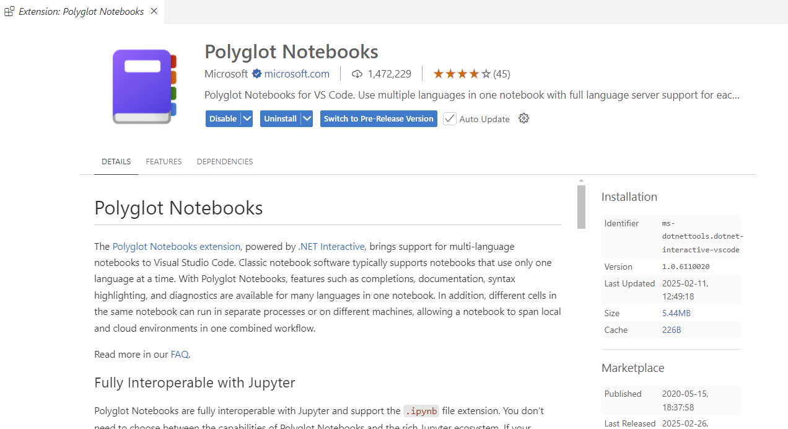
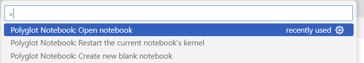

# Custom PowerShell Formatting

This presentation is using a Polyglot Notebook. To open and run the notebook file, `customformatting.dib`, you will need to install the [Polyglot Notebooks extension](https://marketplace.visualstudio.com/items?itemName=ms-dotnettools.dotnet-interactive-vscode) for Visual Studio Code, including required dependencies.

Once all VS Code extensions have been installed, open the VS Code Command Palette and run the `Open Polyglot Notebook` command.

Select the `customformatting.dib` file to open the notebook. The notebook and demonstrations assume you are running PowerShell 7.2 or later.

> *All code samples are offered AS-IS and should be considered educational material.*
